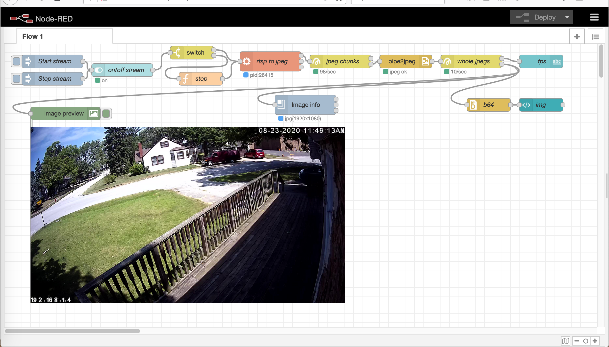

# node-red-contrib-pipe2jpeg
######
[](https://github.com/kevinGodell/node-red-contrib-pipe2jpeg/blob/master/LICENSE)
[](https://www.npmjs.com/package/node-red-contrib-pipe2jpeg)
[](https://github.com/kevinGodell/node-red-contrib-pipe2jpeg/issues)
#### What?
- A node-red wrapper for pipe2jpeg.
#### Why?
- Needed for extracting individual jpeg(s) from a jpeg buffer stream.
#### How?
- Searches for the beginning (`0xFF 0x08`) and ending (`0xFF 0x09`) file markers.
#### When?
- Using ffmpeg to connect to a video source and piping out jpegs via `-c:v mjpeg -f image2pipe`.
#### Requirements
- Input must be a buffer stream that contains jpeg(s).
- Output will be a buffer containing a single jpeg.
#### Links
- [node-red](https://nodered.org/)
- [ffmpeg](https://ffmpeg.org/)
- [buffer](https://nodejs.org/api/buffer.html)
- [pipe2jpeg](https://www.npmjs.com/package/pipe2jpeg)
#### Installation
```
npm install node-red-contrib-pipe2jpeg
```
#### Screenshots

